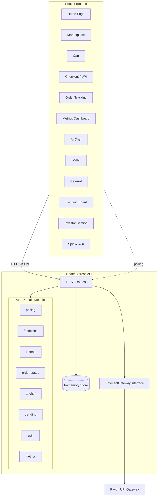
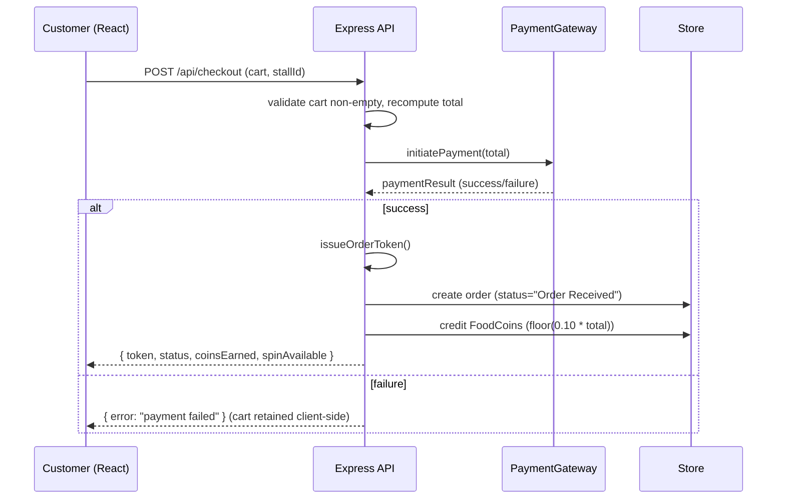
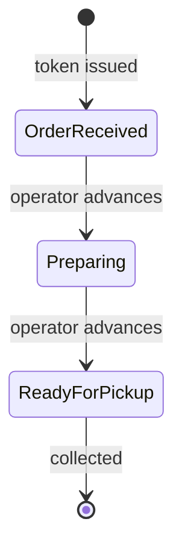

# Design Document

## Overview

ByteBites is a single-page React frontend backed by a minimal Node.js (Express) API, integrating the Paytm UPI payment gateway. The application delivers a food marketplace with fintech-style features: a digital wallet (FoodCoins), UPI checkout with order tokens, live order-status tracking, a startup metrics dashboard, an AI Chef recommender, a referral program, a trending board, an investor pitch section, and Spin & Win gamification.

The design separates concerns into three layers:

- **Presentation (React)**: Pages and components for browsing, cart, checkout, tracking, dashboards, and gamification.
- **API (Node/Express)**: Thin HTTP layer that validates input, orchestrates domain logic, and mediates payment gateway calls.
- **Domain logic (pure modules)**: Framework-agnostic functions for pricing, FoodCoins math, recommendation scoring, token issuance, order-status transitions, trending ranking, and spin reward selection. These pure modules are the primary target for property-based testing.

Because the event is a festival demo, persistence is intentionally simple: an in-memory store (with optional JSON file snapshot) on the backend, seeded with stalls and food items. Real-time updates (order status, metrics, trending) use short-interval polling (client refresh within 5 seconds), which satisfies the "within 5 seconds" acceptance criteria without the operational cost of websockets.

### Key Design Decisions

| Decision | Rationale |
| --- | --- |
| Pure domain modules separated from React and Express | Enables fast, deterministic property-based testing of business rules (pricing, coins, tokens, ranking) without UI or network. |
| Polling every ~3s for status/metrics/trending | Meets the 5-second freshness requirement simply and reliably for a demo; avoids websocket infrastructure. |
| In-memory store with seed data | Festival demo scope; no external DB dependency; deterministic resets between demo runs. |
| Server-authoritative order/payment/coins | Prevents client tampering with tokens, balances, and rewards; the client only renders server state. |
| Paytm integration behind a `PaymentGateway` interface | Allows a mock gateway for local/dev and tests, and the real Paytm adapter in the deployed demo. |

## Architecture



### Request Flow: Checkout and Payment



### Order Status Progression



## Components and Interfaces

### Frontend Components (React)

- **HomePage**: Hero (heading, subheading, tagline) and three navigation buttons (Order Now, Trending Foods, Investor Dashboard).
- **Marketplace**: Renders `FoodItemCard` list; supports stall context from QR route param.
- **FoodItemCard**: Displays image, description, star rating (0-5), available quantity, price (INR), and an Add to Cart button disabled when quantity is 0.
- **CartView**: Line items (name, unit price, qty, line total), order total, quantity controls, remove control, over-quantity notice.
- **CheckoutView**: Triggers UPI payment, shows failure messages, displays issued token on success.
- **OrderTracker**: Polls order status; renders current status label.
- **MetricsDashboard**: Polls and renders the five metrics.
- **AIChefView**: Collects hunger level, spice preference, sweet-or-savory; renders recommendation(s) with confidence score.
- **WalletView**: Shows FoodCoins balance; redemption controls (toppings, discounts, lucky draw).
- **ReferralView**: Displays unique referral link.
- **TrendingBoard**: Polls and renders ranked items with ordered quantity.
- **InvestorSection**: Static pitch content (vision, revenue model, growth strategy, traction).
- **SpinWheel**: Offered once per paid order; animates and displays awarded reward.

### API Endpoints (Express)

| Method | Path | Purpose |
| --- | --- | --- |
| GET | `/api/stalls/:stallId/menu` | Marketplace menu for a stall (404 if unknown stall). |
| POST | `/api/checkout` | Initiate payment, on success create order + issue token + credit coins. |
| GET | `/api/orders/:token` | Current order status for tracking. |
| POST | `/api/orders/:token/advance` | Operator advances order status. |
| GET | `/api/metrics` | Current day's metrics. |
| POST | `/api/ai-chef/recommend` | Recommendations from preference inputs. |
| GET | `/api/wallet/:customerId` | FoodCoins balance. |
| POST | `/api/wallet/:customerId/redeem` | Redeem FoodCoins (reject if insufficient). |
| GET | `/api/referral/:customerId` | Referral link for the customer. |
| POST | `/api/referral/claim` | Credit referrer on referred customer's first order. |
| GET | `/api/trending` | Ranked items by units ordered today. |
| POST | `/api/orders/:token/spin` | Perform the single spin for a paid order. |

### PaymentGateway Interface

```typescript
interface PaymentResult {
  success: boolean;
  gatewayRef?: string;   // Paytm transaction reference when successful
  failureReason?: string;
}

interface PaymentGateway {
  initiatePayment(amountInRupees: number, orderContext: OrderContext): Promise<PaymentResult>;
}
```

Two implementations: `PaytmGateway` (real UPI) and `MockGateway` (deterministic, used in dev and tests).

### Pure Domain Module Signatures

```typescript
// pricing.ts
function lineTotal(unitPrice: number, quantity: number): number;
function orderTotal(items: CartItem[]): number;
function clampQuantity(requested: number, available: number): { quantity: number; clamped: boolean };

// foodcoins.ts
function coinsForOrder(orderTotal: number): number;   // floor(0.10 * total)
function applyRedemption(balance: number, amount: number):
  { balance: number; ok: boolean };

// tokens.ts
function issueToken(existingTokens: Set<string>): string;   // unique

// order-status.ts
type OrderStatus = "Order Received" | "Preparing" | "Ready for Pickup";
function nextStatus(current: OrderStatus): OrderStatus;      // last stays last

// ai-chef.ts
function recommend(prefs: Preferences, items: FoodItem[]):
  { items: RecommendedItem[]; exactMatch: boolean };

// trending.ts
function rankTrending(orders: PaidOrder[]): TrendingEntry[]; // desc by units

// spin.ts
function spin(rng: () => number): SpinReward;

// metrics.ts
function computeMetrics(orders: PaidOrder[], ratings: number[]): Metrics;
```

## Data Models

```typescript
interface FoodItem {
  id: string;
  name: string;
  imageUrl: string;
  description: string;
  rating: number;          // 0..5 (startup rating)
  availableQuantity: number;
  price: number;           // INR, > 0
  stallId: string;
  spice: "mild" | "medium" | "hot";
  flavor: "sweet" | "savory";
  portion: "light" | "regular" | "hearty";  // maps to hunger level
}

interface CartItem {
  itemId: string;
  name: string;
  unitPrice: number;       // INR
  quantity: number;        // >= 1
}

interface Stall {
  id: string;
  name: string;
  qrSlug: string;          // used in QR link
}

type OrderStatus = "Order Received" | "Preparing" | "Ready for Pickup";

interface Order {
  token: string;           // unique Order_Token
  stallId: string;
  items: CartItem[];
  total: number;           // INR
  status: OrderStatus;
  paid: boolean;
  paymentMethod: "UPI" | "other";
  gatewayRef?: string;
  customerId: string;
  createdAt: string;       // ISO timestamp
  spinUsed: boolean;
}

interface Wallet {
  customerId: string;
  foodCoins: number;       // >= 0, integer
}

interface Preferences {
  hunger: "light" | "regular" | "hearty";
  spice: "mild" | "medium" | "hot";
  taste: "sweet" | "savory";
}

interface RecommendedItem {
  item: FoodItem;
  confidence: number;      // 0..100
}

interface TrendingEntry {
  itemId: string;
  name: string;
  unitsOrdered: number;
}

type SpinReward = "5% discount" | "free drink" | "double FoodCoins" | "lucky draw ticket";

interface Referral {
  customerId: string;
  link: string;                 // unique
  creditedReferredIds: string[]; // referred customers already rewarded (once each)
}

interface Metrics {
  totalOrdersToday: number;
  revenueGenerated: number;        // sum of paid order totals today
  digitalPaymentPercentage: number; // % of paid orders via gateway, 0..100
  bestSellingProduct: string | null;
  customerSatisfactionScore: number; // 0..5
}
```

### Data Model Notes

- **Money**: Prices and totals are stored as numbers in INR. FoodCoins are always integers (floor rule). To avoid float drift in totals, monetary math is computed on integer paise internally where feasible, then presented in rupees.
- **Uniqueness**: `Order.token` and `Referral.link` are unique across the store.
- **Trending & metrics scope**: "current day" is derived from `createdAt` against the server's local date.

## Correctness Properties

*A property is a characteristic or behavior that should hold true across all valid executions of a system-essentially, a formal statement about what the system should do. Properties serve as the bridge between human-readable specifications and machine-verifiable correctness guarantees.*

These properties target the pure domain modules (pricing, foodcoins, tokens, order-status, ai-chef, trending, spin, metrics) and the server-authoritative order flow. UI-only text, static pitch content, and polling timing are covered by example and integration tests instead (see Testing Strategy).

### Property 1: Food item card renders all required fields

*For any* generated FoodItem (with rating in 0..5, including the boundary values 0 and 5, and varied available quantity), the rendered item card contains the image, description, star rating matching the rating value, available quantity, and price in Indian Rupees.

**Validates: Requirements 2.1, 2.2, 2.5**

### Property 2: Availability gates Add to Cart

*For any* FoodItem, the "Add to Cart" action is disabled and the item is shown as unavailable if and only if its available quantity is 0.

**Validates: Requirements 2.3**

### Property 3: Adding an item increases its cart quantity by one

*For any* cart and any available FoodItem, adding that item results in the cart containing exactly one more unit of that item than before, with all other items unchanged.

**Validates: Requirements 2.4**

### Property 4: Order total equals the sum of line totals

*For any* cart, the order total equals the sum over all items of (unit price × quantity), and this holds after any sequence of quantity increases, decreases, additions, or removals. Each line total equals its unit price times its quantity.

**Validates: Requirements 3.1, 3.2, 3.3, 3.4**

### Property 5: Removed items leave the cart and the total recomputes

*For any* cart and any item in it, after removal the item is absent from the cart and the order total equals the sum of the line totals of the remaining items.

**Validates: Requirements 3.4**

### Property 6: Quantity is clamped to available with a notice

*For any* requested quantity and available quantity, if the requested quantity exceeds the available quantity then the resulting quantity equals the available quantity and the clamped/notice flag is set; otherwise the quantity is unchanged and no notice is set.

**Validates: Requirements 3.5**

### Property 7: Stall menu contains only that stall's items

*For any* set of stalls and food items, requesting the menu for a known stall returns only items whose stallId equals that stall.

**Validates: Requirements 4.1**

### Property 8: Orders are associated with their originating stall

*For any* successful checkout performed in the context of a given stall, the created order's stallId equals that stall.

**Validates: Requirements 4.2**

### Property 9: Payment amount equals the recomputed order total

*For any* non-empty cart, confirming checkout initiates a payment request whose amount equals the server-recomputed order total for that cart.

**Validates: Requirements 5.1**

### Property 10: Issued order tokens are unique and non-empty

*For any* sequence of successful orders, every issued Order_Token is non-empty and no token is issued more than once.

**Validates: Requirements 5.2**

### Property 11: Failed payment creates no order and retains the cart

*For any* cart, if the Payment_Gateway reports failure, then no order is created and the cart contents remain unchanged.

**Validates: Requirements 5.3**

### Property 12: New orders start in "Order Received"

*For any* successfully paid order, the initial Order_Status is "Order Received".

**Validates: Requirements 5.4**

### Property 13: Status advances by exactly one step and never regresses

*For any* Order_Status, advancing moves it to the immediate next value in the sequence ("Order Received" → "Preparing" → "Ready for Pickup"), "Ready for Pickup" remains "Ready for Pickup", and no advance skips a value or moves backward.

**Validates: Requirements 6.1, 6.2**

### Property 14: Displayed status matches stored status

*For any* order, the status shown to a customer viewing its token equals the order's current stored Order_Status.

**Validates: Requirements 6.3**

### Property 15: Revenue equals the sum of today's paid order totals

*For any* set of orders spanning multiple dates and paid/unpaid states, the computed Revenue Generated equals the sum of the totals of orders that are paid and dated for the current day.

**Validates: Requirements 7.2**

### Property 16: Digital payment percentage is the gateway-paid ratio

*For any* set of paid orders, the Digital Payment Percentage equals (orders paid through the Payment_Gateway ÷ total paid orders) × 100, and equals 0 when there are no paid orders.

**Validates: Requirements 7.3**

### Property 17: Customer satisfaction score stays within 0..5

*For any* set of rating inputs, the computed Customer Satisfaction Score is a value within the inclusive range 0 to 5.

**Validates: Requirements 7.4**

### Property 18: A recommendation is always returned for a non-empty menu

*For any* set of preference inputs and any non-empty Marketplace menu, the AI_Chef returns at least one recommended item.

**Validates: Requirements 8.2**

### Property 19: Confidence scores stay within 0..100

*For any* AI_Chef recommendation output, every recommended item has a Confidence_Score within the inclusive range 0 to 100.

**Validates: Requirements 8.3**

### Property 20: No exact match falls back to the highest-rated available item

*For any* menu with no item matching the submitted preferences, the AI_Chef returns the highest-rated available item and sets the no-exact-match indicator.

**Validates: Requirements 8.4**

### Property 21: FoodCoins earned equal 10% of the total, floored

*For any* order total, the FoodCoins credited equal floor(0.10 × total) and are always a non-negative integer.

**Validates: Requirements 9.1**

### Property 22: Valid redemption deducts exactly the redeemed amount

*For any* wallet balance and redemption amount less than or equal to the balance, the redemption succeeds and the new balance equals the previous balance minus the redeemed amount.

**Validates: Requirements 9.3**

### Property 23: Over-redemption is rejected and leaves the balance unchanged

*For any* wallet balance and redemption amount greater than the balance, the redemption is rejected and the balance remains unchanged.

**Validates: Requirements 9.4**

### Property 24: Referral links are unique per customer

*For any* set of customers, each generated referral link is non-empty and no link is shared by two customers.

**Validates: Requirements 10.1**

### Property 25: Referral crediting awards 10 coins exactly once per referred customer

*For any* referred customer, completing a first successful order via a referral link credits the referring customer with exactly 10 FoodCoins, and any subsequent claim for the same referred customer credits nothing further (idempotent).

**Validates: Requirements 10.2, 10.3**

### Property 26: Trending is ranked descending with correct counts

*For any* set of today's paid orders, the Trending_Board output is ordered in non-increasing order of units ordered, and each entry's ordered quantity equals the total units of that item across today's paid orders.

**Validates: Requirements 11.1, 11.3**

### Property 27: Spin reward is always drawn from the allowed set

*For any* random draw, the Spin_Game reward is one of "5% discount", "free drink", "double FoodCoins", or "lucky draw ticket".

**Validates: Requirements 13.2**

### Property 28: Awarded spin rewards are applied to the account

*For any* reward awarded by the Spin_Game, the corresponding effect (discount, free drink credit, doubled FoodCoins, or lucky draw ticket) is applied to the customer's account exactly once.

**Validates: Requirements 13.3**

### Property 29: Exactly one spin per paid order

*For any* order, a spin is available only if the order is paid, the first spin on a paid order succeeds, and any further spin attempt on the same order is rejected; unpaid orders cannot spin.

**Validates: Requirements 13.1, 13.4**

## Error Handling

| Scenario | Handling |
| --- | --- |
| Unknown stall QR link | API returns 404 with a "Stall not found" message; client renders an error view (Req 4.3). |
| Empty cart at checkout | API rejects with 400 before contacting the gateway; no payment initiated. |
| Payment failure | API returns a failure response; client shows a payment failure message and retains cart contents (Req 5.3). |
| Payment gateway timeout/unreachable | Treated as a failed payment; no order created, cart retained; user may retry. |
| Advancing an order already at "Ready for Pickup" | No-op; status remains "Ready for Pickup" (Req 6.1, 6.2). |
| Redeeming more coins than balance | API rejects with an insufficient-balance message; balance unchanged (Req 9.4). |
| Double referral claim for same referred customer | Idempotent; no additional credit (Req 10.3). |
| Second spin attempt on the same order | Rejected; the single spin per order is enforced server-side (Req 13.4). |
| Quantity exceeding availability | Clamped to available quantity with a notice rather than an error (Req 3.5). |
| No AI Chef match | Graceful fallback to highest-rated available item with a "no exact match" notice (Req 8.4). |

All API error responses use a consistent JSON shape `{ error: string, code: string }` and appropriate HTTP status codes. The client surfaces user-facing messages without exposing internal details.

## Testing Strategy

The system is tested with a complementary combination of property-based tests (for the pure domain logic and server-authoritative rules), example-based unit tests (for UI content and specific scenarios), and integration tests (for infrastructure timing and end-to-end flows).

### Property-Based Testing

Property-based testing IS appropriate here because the core business rules — pricing/aggregation, FoodCoins arithmetic, token uniqueness, status transitions, recommendation scoring, trending ranking, and spin selection — are pure functions with clear input/output behavior and universal properties over large input spaces.

- **Library**: `fast-check` with the test runner (`vitest` or `jest`) already used by the React/Node project. Property tests must not reimplement PBT from scratch.
- **Iterations**: Each property-based test runs a minimum of 100 iterations.
- **Traceability**: Each property test is tagged with a comment referencing the design property, using the format:
  `// Feature: bytebites, Property {number}: {property_text}`
- **Coverage**: Each Correctness Property (1-29) is implemented by a SINGLE property-based test.
- **Generators**: Custom generators produce FoodItems (rating 0..5 including bounds, quantity including 0, positive prices), carts (including empty and large), preference combinations, order sets spanning dates/paid states, wallet balances, and referral scenarios. Boundary values (quantity 0, rating 0 and 5, empty menus, zero balance, requested == available) are included so edge-case criteria (2.2, 4.3) are exercised through the property generators.

### Example-Based Unit Tests

Used for static content and specific interactions that do not vary meaningfully with input:

- Home page hero heading, subheading, tagline, and three navigation buttons (Req 1.1, 1.2, 1.6).
- Navigation routing on each button click (Req 1.3, 1.4, 1.5).
- Token display after a successful checkout (Req 5.5).
- Metrics dashboard renders all five metric fields (Req 7.1).
- AI Chef form collects the three preference inputs (Req 8.1).
- Wallet balance display and the three redemption option types (Req 9.2, 9.5).
- Investor section renders vision, revenue model, growth strategy, and traction (Req 12.1-12.4).
- Unknown stall error view (Req 4.3) as a concrete example, complementing the generated-id edge cases.

### Integration Tests

Used for timing/polling and cross-component wiring that PBT is not suited for:

- Order status updates reflected in the UI within 5 seconds via polling (Req 6.4).
- Metrics dashboard refreshes Total Orders Today and Revenue within 5 seconds after a paid order (Req 7.5).
- Trending board re-ranks within 5 seconds after a paid order (Req 11.2).
- End-to-end checkout against the `MockGateway` (success and failure paths), verifying order creation, token issuance, coin crediting, and spin availability.
- Paytm sandbox smoke test verifying the real `PaytmGateway` adapter initiates a UPI request (single execution, not repeated).
